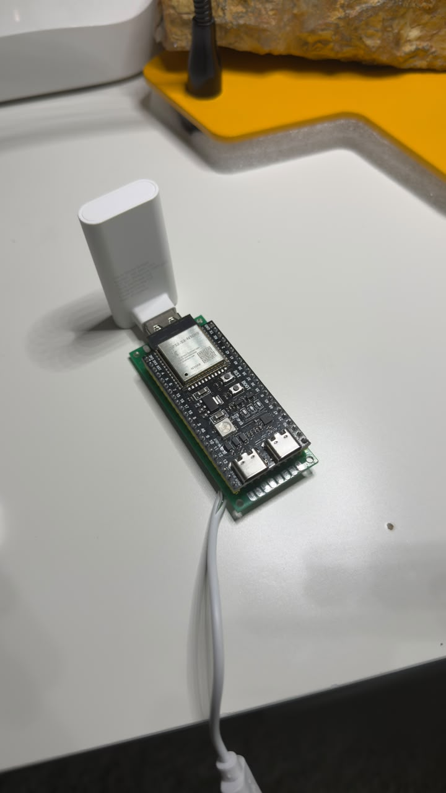
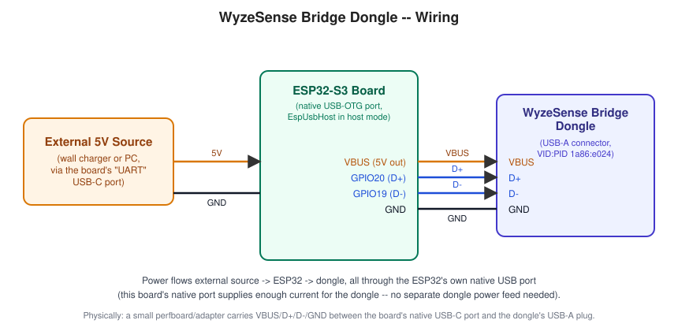
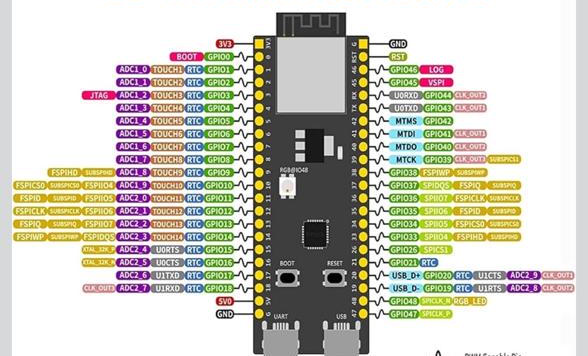
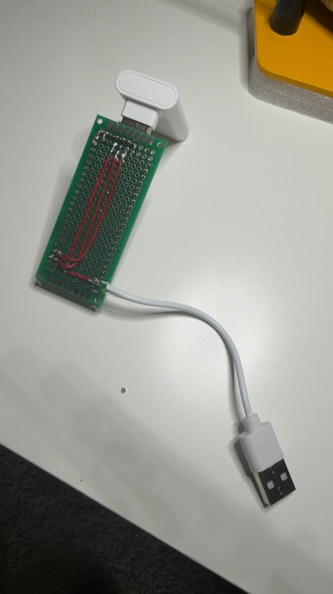

# esp32-neos-alexa-bridge

Custom firmware that revives a decommissioned NEOS smart-home hub. NEOS shut
down its cloud service, bricking the hub itself, but the USB bridge dongle
inside it and its paired WyzeSense-compatible contact/motion sensors are
still perfectly good hardware speaking a well-understood, reverse-engineered
protocol. This project puts an ESP32-S3 in USB host mode in place of the
original hub's brain, decodes sensor events on-device, and re-exposes each
sensor to Amazon Alexa as a real Matter Contact Sensor / Occupancy Sensor
endpoint -- so Alexa Routines can trigger off them ("when the front door
opens...") the same way they would with any commercial smart-home sensor.

## How it works

- **USB bridge protocol.** The dongle (VID:PID `1a86:e024`) speaks a
  protocol reverse-engineered by [@hclxing's `wyzesense`
  project](https://github.com/HclX/WyzeSensePy). `lib/wyzesense_protocol`
  and `lib/wyzesense_dongle` are a from-scratch C++ port of that protocol
  (framing, checksums, the pairing/scan handshake, sensor alarm decoding),
  verified byte-for-byte against the real Python implementation's own
  output (see `test_native/`).
- **USB host.** The ESP32-S3's native USB-OTG peripheral runs in host mode
  via [EspUsbHost](https://github.com/tanakamasayuki/EspUsbHost), reading
  raw HID reports from the bridge and feeding them to the protocol decoder.
- **Alexa integration.** Each paired sensor is exposed as a genuine Matter
  endpoint (`MatterContactSensor` / `MatterOccupancySensor`, from
  Arduino-ESP32's Matter support), not a fake Hue/WeMo light -- Matter
  sensor endpoints are what let Alexa Routines see "opened/closed" and
  "motion detected" as trigger conditions in the first place.
- **No hardcoded devices.** Sensor MAC addresses, which physical sensor
  maps to which Matter endpoint, and WiFi credentials are never baked into
  source. MAC-to-endpoint assignment is learned at runtime (from pairing,
  or from a sensor's first event after a reboot) and persisted in the
  ESP32's own flash (NVS via `Preferences`); WiFi credentials live in a
  gitignored `include/secrets.h` you create yourself (see Setup below).

## Hardware

- ESP32-S3 with **8MB of PSRAM** (see "Memory" below for why this actually
  matters, not just a nice-to-have). This project was built and tested on
  an ESP32-S3-WROOM-1-N16R8 module (16MB flash, 8MB embedded PSRAM over
  Octal SPI); the `qio_opi` memory-type setting in `platformio.ini` is
  specific to that combination -- see the comment there for how to check
  and adjust for your own board.
- A NEOS/WyzeSense USB bridge dongle, salvaged from the hub.
- One or more paired WyzeSense-compatible contact or motion sensors.

### Wiring



The board has two USB-C ports:

- **"UART" port** -- powers the whole board and carries the serial
  console (`Serial.print`) to your computer. This project deliberately
  never enables `ARDUINO_USB_CDC_ON_BOOT`, so this port always behaves
  like a normal UART-over-USB serial adapter. Plug this into a computer
  or a wall charger.
- **Native "USB" port** (internally wired to GPIO19=D-/GPIO20=D+, confirmed
  against this board's own pinout reference below) -- this is what
  EspUsbHost drives in host mode to talk to the bridge dongle, and on
  this board it also supplies the dongle's own power (VBUS) -- no
  separate power feed to the dongle is needed.

| ESP32-S3 pin | Signal | Connects to |
|--------------|--------|-------------|
| GPIO20        | USB D+ | Bridge dongle D+ |
| GPIO19        | USB D- | Bridge dongle D- |
| (native USB port VBUS) | 5V out | Bridge dongle VBUS |
| (native USB port GND)  | GND    | Bridge dongle GND  |

The ESP32 itself is powered separately, through its "UART" port, from
whatever 5V source you plug in there (wall charger or a computer).





Physically, a small perfboard adapter carries VBUS/D+/D-/GND between the
board's native USB-C port and the dongle's USB-A plug -- a connector
adapter, not a separate power source. (An earlier revision of this
project used a different ESP32-S3 board whose native port genuinely
couldn't supply enough current for the dongle and needed its own
external 5V feed; this board doesn't have that limitation, so don't
assume yours does either -- check before wiring a separate supply to
the dongle that you may not need.)



## Setup

1. Install [PlatformIO](https://platformio.org/) (VS Code extension or
   `pio` CLI).
2. **Build the fixed Matter library** (see below) -- required until
   arduino-esp32 ships a release containing PR #12842.
3. `pio run -t upload` (or use PlatformIO's Upload button).
4. Connect to WiFi (see "WiFi setup" below) -- no `secrets.h` or rebuild
   needed for this.
5. Open the serial monitor at 115200 baud on the UART port to watch boot
   logs, pair sensors, and read the Matter commissioning code.

### WiFi setup

No WiFi credentials are baked into the firmware at build time. On first
boot (or anytime after a WiFi reset), the device starts its own open
WiFi network and a small setup page instead of trying to connect
anywhere:

1. Connect your phone or laptop to the **`esp_neos_bridge`** WiFi
   network (open, no password).
2. Visit **http://192.168.4.1/** in a browser.
3. Pick your home network from the dropdown (populated from a scan the
   device runs right before starting its own network) and enter its
   password.
4. Submit. The device saves the credentials to flash, reboots, and
   connects to your network from then on.

**To reconfigure later** (moved to a new network, wrong password, etc.):
hold the **BOOT** button for about 5 seconds while the device is running
normally. It clears the stored credentials and reboots straight back
into the setup flow above -- no USB/serial access needed, which matters
once the board is mounted somewhere physically awkward to reach.

If you'd rather set WiFi at build time instead of using the portal, copy
`include/secrets.h.example` to `include/secrets.h` (gitignored, never
committed) and fill in real credentials -- this seeds the stored
credentials once, on the very first boot with nothing configured yet,
and is otherwise ignored (see the comments in that file).

### Building the fixed Matter library

The precompiled `framework-arduinoespressif32-libs` package PlatformIO
installs needs two kinds of local changes before it works well for this
project: a real upstream bug fix, and a memory-allocation tuning change.
Both require rebuilding it yourself with
[esp32-arduino-lib-builder](https://github.com/espressif/esp32-arduino-lib-builder)
-- there's no way to patch the precompiled `.a` files PlatformIO downloads
directly.

**1. The BooleanState attribute bug.** Arduino-ESP32's Matter binary-sensor
wrapper (contact/motion/leak/etc.) has a real bug against Matter 1.5's new
delegate-based `BooleanState` cluster: every `setContact()`/`setOccupancy()`
call fails silently with `ESP_ERR_NOT_SUPPORTED`, so Alexa never sees a
state change. Fixed upstream in
[espressif/arduino-esp32#12842](https://github.com/espressif/arduino-esp32/pull/12842)
("fix(matter): fix binary sensors for Matter 1.5"), merged 2026-08-21.
`platformio.ini` already points `framework-arduinoespressif32` (the
wrapper *source*) at `master` via `platform_packages`, which gets you this
fix's source-level changes automatically -- but the separate, precompiled
`framework-arduinoespressif32-libs` package still ships the old binary
built before the fix, and needs rebuilding (step below) until a release
containing #12842 ships.

**2. Memory allocation mode.** By default, esp-matter is configured to
allocate its data model (including Matter's subscription/session state)
from internal RAM only, never PSRAM, even when PSRAM is available and
enabled. On a 3-endpoint device, Alexa opens roughly 15 concurrent
subscriptions, and servicing that many from ~320KB of internal RAM
(shared with WiFi and, in this project, a full USB-host stack) reliably
runs the device out of heap -- see "Memory: why this needs PSRAM" below
for the full story. This needs two Kconfig changes in the lib-builder
checkout before building.

```sh
git clone --recursive https://github.com/espressif/esp32-arduino-lib-builder
cd esp32-arduino-lib-builder

# As of this writing, this repo's tinyusb submodule clone has no version
# pin and lands past hathach/tinyusb@a57f857f8, which deleted
# vendor_host.c. If your build fails on that file, remove the one
# reference to it in components/arduino_tinyusb/CMakeLists.txt (safe --
# this project doesn't use TinyUSB's host stack, only EspUsbHost's).

# Let esp-matter's data model spill into PSRAM instead of internal-only:
sed -i 's/CONFIG_ESP_MATTER_MEM_ALLOC_MODE_INTERNAL=y/CONFIG_ESP_MATTER_MEM_ALLOC_MODE_DEFAULT=y/' \
    configs/defconfig.common

# Same for WiFi/lwIP's own buffer pool (a separate allocator from
# esp-matter's, and the one the "SendMessage() failed" / lwIP ERR_MEM
# errors traced back to):
sed -i 's/CONFIG_SPIRAM_TRY_ALLOCATE_WIFI_LWIP=n/CONFIG_SPIRAM_TRY_ALLOCATE_WIFI_LWIP=y/' \
    configs/defconfig.esp32s3

./build.sh -t esp32s3

# Back up the currently-installed package first, then overwrite it:
cp -a ~/.platformio/packages/framework-arduinoespressif32-libs/esp32s3 \
      ~/.platformio/packages/framework-arduinoespressif32-libs/esp32s3.bak
cp -af out/tools/esp32-arduino-libs/esp32s3/* \
       ~/.platformio/packages/framework-arduinoespressif32-libs/esp32s3/
```

If your board genuinely has no PSRAM, skip the two `sed` lines (they'd be
no-ops for memory that doesn't exist anyway) and use `qio_qspi` instead of
`qio_opi` for `board_build.arduino.memory_type` in `platformio.ini` --
but expect the heap-exhaustion problems described below, since this
project's Matter+WiFi+USB-host footprint doesn't reliably fit in ~320KB
of internal RAM alone.

This is a machine-wide PlatformIO package, not project-local -- it
affects every project on your machine using this framework package.
Budget real time and disk space: the full build pulls the ESP-IDF
toolchain (~4GB), builds five separate flash/PSRAM bus-mode variants
in one pass, and takes an hour or more.

We intentionally don't vendor the rebuilt binary in this repo: it's
tied to the exact toolchain/platform version and Kconfig you have
installed, so a copy that worked for one setup can silently mismatch
another's. Once a release of arduino-esp32 ships with #12842 included
and the memory-allocation defaults changed, delete the
`platform_packages` override in `platformio.ini`, pin a normal release,
and skip this whole section.

## Memory: why this needs PSRAM

This is worth understanding even if you never touch the lib-builder
config, because it explains several otherwise-baffling symptoms: Alexa
showing a sensor's state as stuck/stale, a device's detail page never
loading, or session errors like `Failed to establish CASE for
subscription-resumption`, `PacketBuffer: pool EMPTY`, or `SendMessage()
... failed: 3000001` in the serial log.

The ESP32-S3 has 512KB of on-die SRAM, but only ~320KB (327,680 bytes) of
that is actually available to application code as heap -- the rest is
reserved for the boot ROM and instruction RAM. Alexa's Matter controller
opens roughly 15 concurrent subscriptions against a 3-endpoint device
(seemingly one per cluster per endpoint). Servicing that many, on top of
WiFi and this project's own USB-host stack, all sharing ~320KB, reliably
drives free heap down to a few hundred bytes -- we measured it bottoming
out at 164 bytes in testing. When that happens, whatever allocation
happens to be in flight (usually lwIP trying to allocate a UDP send
buffer, or CHIP's own packet buffer pool) fails, and that specific
attribute report is silently dropped -- Alexa never receives it, and
there's no error visible from the controller side, only in the device's
own serial log.

Adding PSRAM and reconfiguring esp-matter/WiFi to actually use it (see
above) doesn't remove the ~320KB limit, but it gives the memory-hungry
allocations (Matter's subscription/session state, WiFi's buffer pool)
several more megabytes of headroom to spill into instead of fighting
over scraps of internal RAM alongside everything else.

**If you hit this and don't have a PSRAM board handy:** `factory-reset`
over serial (see below) at least clears out any stale/broken persisted
subscriptions accumulated from repeated re-commissioning, which can make
the problem measurably worse than a single legitimate Alexa subscription
would cause on its own.

## Usage

- **Pairing a new sensor:** hold the BOOT button while the board powers
  up, send `p` over the serial console once the dongle reports ready, or
  click "Start Pairing" on the web status page (`http://<device-ip>:8080/`
  -- also shows a live status dot and a "Stop Pairing" button, so you can
  cancel the 60-second window early without waiting it out). Then trigger
  the sensor's own pairing action (battery pull-tab or reset pinhole,
  depending on sensor type). The sensor is auto-assigned to a free Matter
  endpoint and the mapping is persisted in flash.
- **Commissioning in Alexa:** once flashed and connected to WiFi, the
  serial console prints a Matter manual pairing code and QR code URL
  every 10 seconds until commissioned. Add the device in the Alexa app
  via Add Device -> Matter.
- Sensor pool size is fixed at compile time (`kMaxContact`/`kMaxMotion` in
  `src/main.cpp`) to match this project's exact hardware (2 contact + 1
  motion sensor). Bump those constants and reflash if you have more
  sensors.
- **State survives reboots.** WyzeSense sensors only ever report
  *transitions*, never "what's your current state right now" -- a sensor
  that's stayed closed since before a reboot generates no event to tell a
  fresh boot about it. Every real sensor event is persisted to flash and
  restored the moment a sensor's MAC gets (re-)assigned to its Matter
  endpoint, so a reboot doesn't leave Alexa showing a stale/wrong state
  for a sensor that hasn't actually changed.

## Recovery: factory-resetting the Matter node

Two ways to trigger this:

- Send `factory-reset` over the serial console.
- Visit `http://<device-ip>:8080/` in a browser on the same WiFi network
  and click "Factory Reset" -- useful once the board is mounted somewhere
  the USB port isn't reachable. This page also shows commissioning
  status, live USB-bridge-connected/dongle-ready/pairing-mode indicators,
  pairing controls, the pairing code/QR link when uncommissioned, free
  heap, and each sensor's last-known state, with no authentication (it
  trusts the
  local WiFi network as its security boundary -- don't port-forward it
  to the internet).

Either way, this wipes the device's Matter fabric/commissioning/
subscription state and reboots. Remove the device(s) from the Alexa app
first, then trigger the reset, then re-add them via Add Device -> Matter
using the fresh pairing code (serial console, or the web page above).
Reasons you'd want this:

- Moving the device to a different Alexa account or location.
- Recovering from a pile of stale subscription-resumption entries: during
  heavy re-commissioning churn (e.g. repeatedly testing/reflashing during
  development), `Matter.begin()` tries to resume every previously-known
  subscription at boot, and it does this eagerly, all at once, rather than
  incrementally. Without PSRAM in use, we measured this failing outright
  at 15 stale entries -- min free heap bottomed out at 164 bytes, and
  CHIP's own packet buffer pool ran dry (`PacketBuffer: pool EMPTY`),
  cascading into CASE session-resumption failures, message retransmission
  failures, and timeouts across the board.
- **Recovering from a single stuck endpoint even with PSRAM in use and
  heap otherwise healthy.** We hit a case where one specific endpoint's
  attribute reports kept generating cleanly on the device side (no error
  in the serial log) but never showed up in Alexa at all, for many
  minutes, even surviving a full power-cycle reboot -- while a second,
  identical endpoint on the same device worked fine throughout. The
  most likely explanation: that endpoint's *persisted* subscription-
  resumption entry itself was stale/corrupted from earlier testing churn,
  and kept failing to resume on every boot rather than being freshly
  re-created. A full `factory-reset` plus removing and re-adding the
  device(s) in Alexa (not just a reboot) resolved it completely. If a
  single sensor seems permanently stuck while others on the same board
  work fine, this -- not a code bug -- is the first thing to try.

A normally-used device with one real, stable Alexa subscription shouldn't
accumulate enough entries to hit either of these in practice; both showed
up here specifically because of the unusually heavy re-flashing/re-pairing
churn of active development.

**A genuine full power-off (not just a soft reset) has also been observed
to retrigger this same subscription staleness**, even on a device that had
been working reliably for hours beforehand, with no re-flashing or
re-pairing in between. We haven't root-caused why a complete power cycle
specifically (as opposed to the many soft/EN-pin resets used throughout
this project's own testing, which didn't show this) makes a difference --
it may be Alexa-side session-timeout behavior tied to how long the device
is off the network. Practically: this project is recoverable via
factory-reset, not proven bulletproof against every kind of power event.
If you're installing this somewhere power might blip, the web-based
recovery above is there specifically so that doesn't mean a trip up a
ladder.

## Repository layout

- `src/main.cpp`, `platformio.ini`, `include/secrets.h.example`,
  `lib/` -- the actual firmware. This is what you build and flash.
- `test_native/` -- native (non-ESP32) unit tests for the protocol layer,
  runnable on your dev machine without hardware.
- `matter-test/`, `pin-id-test/` -- standalone scratch PlatformIO
  projects used during development to isolate the Matter attribute-update
  bug and verify GPIO wiring. Not needed to build or run the real
  firmware; kept for reference.

## Credits

- Protocol reverse-engineering: [HclX/WyzeSensePy](https://github.com/HclX/WyzeSensePy).
- USB host support: [tanakamasayuki/EspUsbHost](https://github.com/tanakamasayuki/EspUsbHost).
- Matter/Alexa support: [espressif/arduino-esp32](https://github.com/espressif/arduino-esp32).
